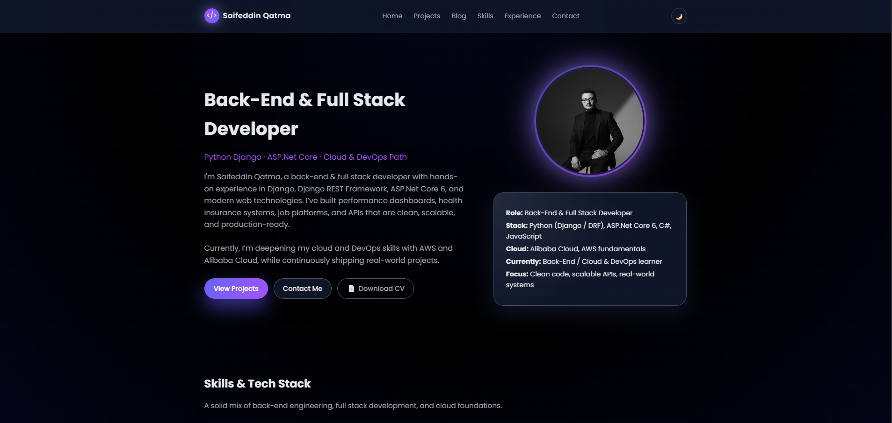
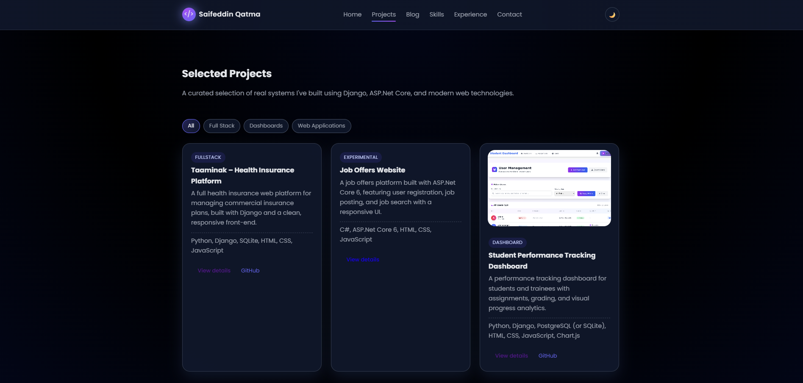
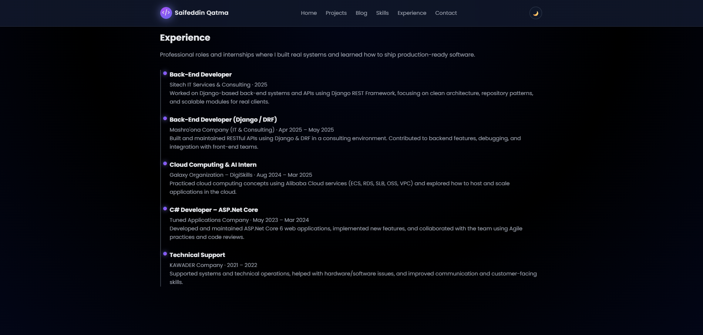

<p align="center">
  
  
  
  
  
</p>

---

# 🌐 **Saifeddin Portfolio Website**

A modern and fully responsive **Django-based portfolio website** showcasing real projects, backend engineering skills, full-stack development capabilities, cloud experience, and technical blog posts.

This portfolio is designed to give recruiters and companies a clear, professional view of my work, skills, experience, and technical growth.

---

# 🎥 **Live Preview (Screenshots)**

### 🏠 Home Page
<p align="center">
  
</p>

### 📂 Projects Page
<p align="center">
  
</p>

### 🧩 Experience Page
<p align="center">
  
</p>

---

# 🚀 **Overview**

This portfolio includes:

- A professional **hero section** with introduction + CV download  
- Dynamic **Projects page** with badges, tech icons, and 3D hover  
- **Project Detail page** with description, tech stack, badges & image  
- A built-in **Blog system**  
- **Experience timeline**  
- **Skills section**  
- Fully working **Contact Form**  
- Clean + scalable Django structure  

---

# 🛠️ **Tech Stack**

### Backend
- Django 5  
- Python 3.13  
- Django Template Engine  
- Django Admin  

### Frontend
- HTML5  
- CSS3  
- Custom animations  
- JavaScript (ES6)  

### Database
- SQLite (Dev)  
- Ready for PostgreSQL in Production  

### Cloud / DevOps (Learning Path)
- Alibaba Cloud  
- AWS Fundamentals  
- Docker basics  
- Linux deployment  

---

# 🔥 **Key Features**

### 🎨 Modern UI / UX
- Dark theme  
- Smooth animations  
- 3D interactions  
- Fully responsive layout  

### 🧑‍💻 Dynamic Projects System
- Add projects from Django Admin  
- Upload project images  
- Tech Stack auto detection → tech icons  
- Project Focus badges:
  - Back-End Heavy  
  - Full Stack  
  - Cloud-Ready  

### 📝 Blog Engine
- Post list page  
- Post detail  
- Excerpts  
- SEO-friendly slug URLs  

### ✉️ Contact System
- Secure with CSRF  
- Django messages feedback  
- Ready for SMTP (Email Integration)

### 📄 Downloadable CV
- Clean download button in Hero section  
- PDF stored inside static files  

---

# 🧱 **Project Structure**

SaifPortfolio/
│
├── portfolio/ # Main Django App
│ ├── models.py # Project + Blog models
│ ├── views.py # Page logic
│ ├── urls.py # Routes
│ ├── admin.py # Admin customization
│ └── templates/
│
├── portfolio_site/ # Django project settings
│
├── static/ # Global static files
│ ├── css/
│ ├── js/
│ ├── img/ # Screenshots + profile image
│ └── docs/ # CV PDF
│
├── media/ # Uploaded project images
│
├── templates/portfolio/ # All HTML pages
│
├── manage.py
└── requirements.txt


---

# ⚙️ **Installation & Running Locally**

### 1. Clone repo
```bash
git clone https://github.com/Sqatmah/Saifeddin_Portfolio.git
cd Saifeddin_Portfolio


2. Create & activate virtual environment
python -m venv venv
venv\Scripts\activate


3. Install dependencies
pip install -r requirements.txt


4. Run migrations
python manage.py migrate


5. Start development server
python manage.py runserver


Open in browser:
http://127.0.0.1:8000/


📬 Contact

Saifeddin Qatma
Back-End & Full Stack Developer

📧 Email: sqatmah@gmail.com

🔗 LinkedIn: https://linkedin.com/in/saifeddin-qatamh

💼 GitHub: https://github.com/Sqatmah


🌐 موقع بورتفوليو سيف الدين قطمة

موقع بورتفوليو احترافي مبني باستخدام Django، مع تصميم عصري يعرض:

المشاريع

الخبرات

المهارات

المقالات

تحميل السيرة الذاتية

نظام تواصل متكامل


🎯 المميزات

صفحة رئيسية قوية ومصممة بشكل جذاب

صفحة مشاريع تفاعلية

صفحة تفاصيل لكل مشروع

نظام مدونة

صفحة مهارات

صفحة خبرات

نموذج تواصل

واجهة إدارة كاملة


🛠️ التقنيات المستخدمة

Django

Python

HTML / CSS / JavaScript

SQLite

جاهز للعمل على PostgreSQL

Alibaba Cloud / AWS (مسار تعلم)


📬 التواصل

📧 sqatmah@gmail.com


⭐ Support

If you like this project, please give it a ⭐ on GitHub — it helps a lot!